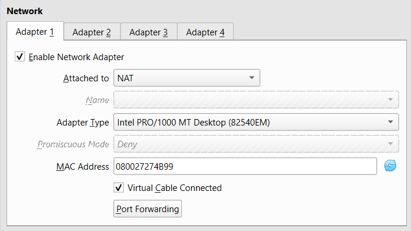
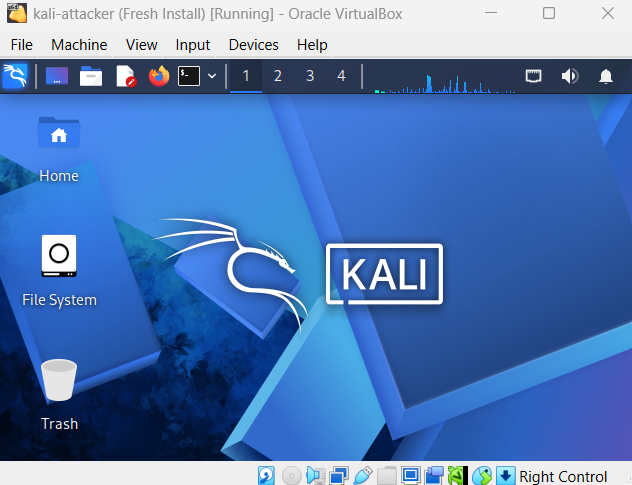

# Kali Attacker Setup

## VM Configuration

| Resource | Amount |
|---|---|
| RAM | 4096 MB |
| CPU | 2 vCPU |
| Disk | 30 GB |

## Network Configuration

- Adapter 1: NAT

---

## Screenshots

### Network Adapter

### VM Setup

---