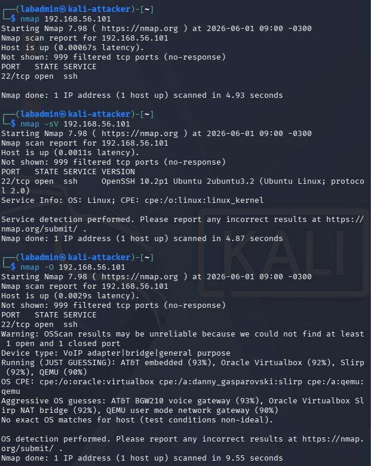

# Nmap Basics

## Objective

Learn how to use Nmap to identify hosts, open ports, and running services within the homelab environment.

---

## Target Information

| Host | IP Address |
|--------|--------|
| Ubuntu Server | 192.168.56.101 |

---

## Connectivity Test

Before scanning, connectivity was verified using ping:

```bash
ping 192.168.56.101
```

Result:
- Successful replies received
- Host reachable from Kali Linux

---

## Basic Port Scan

Command:

```bash
nmap 192.168.56.101
```

Result:

```text
22/tcp open ssh
```

### Findings

The Ubuntu Server was exposing SSH on port 22.

---

## Service Detection

Command:

```bash
nmap -sV 192.168.56.101
```

Result:

```text
PORT   STATE SERVICE VERSION
22/tcp open  ssh     OpenSSH 10.2p1 Ubuntu 2ubuntu3.2
```

### Findings

Nmap identified an SSH service running on TCP port 22.

The scan also revealed the service version:

- OpenSSH 10.2p1
- Ubuntu package: 2ubuntu3.2

### Service Information

```text
Service Info: OS: Linux
```

This indicates that Nmap was able to infer that the target system is running Linux based on the service responses.

### Lessons Learned

- The `-sV` option performs service version detection.
- Nmap can identify not only open ports but also the software running behind them.
- Service enumeration provides more useful information than a basic port scan.
- Version information can be used to investigate vulnerabilities, misconfigurations, and software exposure.

---

## Operating System Detection

Command:

```bash
sudo nmap -O 192.168.56.101
```

Result:

```text
Warning: OSScan results may be unreliable because we could not find at least 1 open
and 1 closed port
Device type: VoIP adapter|bridge|general purpose
Running (JUST GUESSING):
- AT&T embedded (93%)
- Oracle VirtualBox (92%)
- QEMU (90%)
No exact OS matches for host.
```

### Findings

Nmap was unable to accurately identify the operating system of the target host.

Instead of detecting Ubuntu Linux, Nmap returned several possible matches related to virtualization and networking devices.

Nmap displays the following warning:

```text
OSScan results may be unreliable because we could not find at least 1 open
and 1 closed port
```

As of now, the Ubuntu Server only has one open port:

```text
22/tcp open ssh
```

After looking up reasons for this, I found that without a combination of open and closed ports, Nmap has less information available for fingerprinting and may produce inaccurate results.

Additionally, the target is running inside VirtualBox, which can affect how the system responds to probes.

---

## What I Learned

* Nmap successfully identified the Ubuntu Server as a reachable host and detected its exposed services.
* A basic scan was sufficient to discover the SSH service running on TCP port 22.
* Service version detection (`-sV`) provided significantly more information than a standard port scan, including the OpenSSH version running on the target.
* Nmap was able to infer that the target was running Linux through service enumeration, even when OS fingerprinting was inconclusive.
* Operating system detection (`-O`) relies on fingerprinting techniques and may produce unreliable results when insufficient scan data is available.
* Virtualized environments can affect fingerprinting accuracy and should be considered when interpreting scan results.
* Scan results should be treated as evidence rather than absolute truth and validated through multiple sources whenever possible.

---

## Future Experiments

- Install Apache on Ubuntu and scan again.
- Compare results before and after enabling the firewall.
- Perform subnet scans.
- Learn Nmap scripting (NSE).

---

## Screenshots


