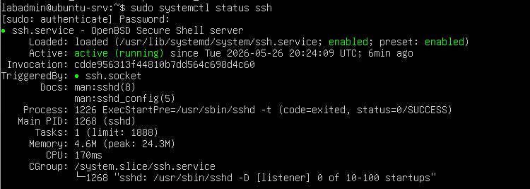
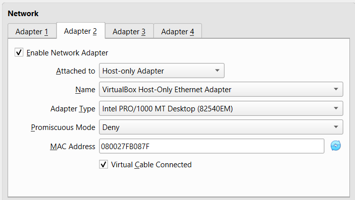

# Ubuntu Server Setup

## VM Configuration

### Ubuntu Server
| Resource | Amount |
|---|---|
| RAM | 2048 MB |
| CPU | 1 vCPU |
| Disk | 20 GB |

## Network Configuration

- Adapter 1: NAT
- Adapter 2: Host-Only Adapter

---

## SSH Configuration

Installed OpenSSH Server:

```bash
sudo apt install openssh-server -y
```

Learned how to check service status:

```bash
systemctl status ssh
```

Connected from Windows cmd:

```powershell
ssh labadmin@192.168.56.101
```

---

## Troubleshooting

I Had an issue where SSH connection was timing out when trying to connect from the Windows cmd.
To fix it, I Learned how to configure Host-Only Adapter in VirtualBox.

---

## Screenshots

### SSH Running


### Network Adapter



### IP Config


### Windows cmd Connected


---